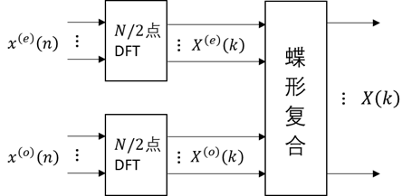
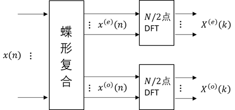

# DSP

——by XZQ

## 第1、2章---绪论、离散信号与系统

1. **数字信号处理的优势**：精度高、可靠性高、灵活性强、便于大规模集成化、便于加密处理、对低频信号尤为优越。
2. **模拟域和数字域的频率**对应关系：$$\omega=\Omega T$$
3. **两大类离散系统**（用差分方程描述）：
   
   - FIR（非递归型）：$$y(n)=\sum_{i=0}^{N}{a_i x(n-i)}$$
   - IIR（递归型）：$$y(n)=\sum_{i=0}^{N}{a_i x(n-i)}+\sum_{i=1}^{N}{b_i y(n-i)}$$
   
4. **留数法求Z反变换**（此外还有幂级数法、部分分式法）
   
   - 分母多项式$$z$$的阶次比分子多项式$$z$$的阶次高二阶或二阶以上：如果在围线$$C$$内有多阶极点而$$C$$外没有多阶极点，可以改求$$C$$外极点的留数之和并取负号。
   - 否则：要考虑$$\infty$$点的留数
   
5. 一个因果稳定系统的传输函数的全部极点必须在单位圆内。（收敛域最外边极点的外边，需要包含单位圆）

6. **S平面到Z平面的映射关系**（$$x_p(t)$$的拉氏变换和$$x(n)$$的Z变换）：
   $$
   z=e^{sT}
   $$
   这是多对一的映射。

7. **Z平面判断系统频率响应**：绕着单位圆转
   $$
   H(e^{j\omega})=K\cdot \frac{\text{到各零点距离乘积}}{\text{到各极点距离乘积}}
   $$

   - 平面原点处的零极点不影响系统的幅频特性。 
   - 极点主要影响幅频特性的峰值，越靠近单位圆，峰值越高越尖锐，极点在单位圆上时该点的频响将出现$$\infty$$，在单位圆外系统不稳定。
   - 零点主要影响幅频特性的谷值，越靠近单位圆谷值越小，在单位圆上时幅度为零，零点可以在单位圆外。

## 第3章---DFT&FFT

1. **DFS**：离散周期序列，时域上是离散序列的周期延拓（卷积冲激串），频域上是周期性频谱的冲激串采样（乘以冲激串）
   $$
   \text{DTFT}\left\{\sum_{m=-\infty}^{+\infty}{\delta(n-mN)} \right\} = 
   \frac{2\pi}{N}\sum_{k=-\infty}^{+\infty}{\delta\left(\omega-\frac{2\pi}{N}k\right)}
   $$

$$
\tilde{x}(n)=
\sum_{r=-\infty}^{+\infty}{x(n-rN)}=
x(n)*\sum_{r=-\infty}^{+\infty}{\delta(n-rN)}
$$

$$
\text{DTFT}\left\{\tilde{x}(n) \right\} =
\frac{2\pi}{N} \sum_{k=-\infty}^{+\infty}{\left(X(e^{j\omega})|_{\omega=\frac{2\pi}{N}k}\right)\times \delta\left(\omega-\frac{2\pi}{N}k\right)}
$$

​	记$$\tilde{X}(k)=X(e^{j\omega})|_{\omega=\frac{2\pi}{N}k}$$，周期为$$N$$
$$
\tilde{x}(n)=\frac{1}{N}\sum_{k=0}^{N-1}{\tilde{X}(k)W_N^{-nk}}
$$

$$
\tilde{X}(k)=\sum_{k=0}^{N-1}{\tilde{x}(n)W_N^{nk}}
$$

​	其中，$$W_N=e^{-j\frac{2\pi}{N}}$$

2. **DFT**：DFS的主值序列，在时域，频域都只取$$\{0,1,...,N-1\}$$
3. DFT的点数不应低于$$x(n)$$的长度。
4. 两个有限长序列，时域的循环卷积等于频域的相乘。为什么是循环卷积：本质上还是DFS取主值序列。
5. N点循环卷积：线性卷积结果以N为周期延拓后相加
6. **用循环卷积计算线性卷积**：
   - 重叠保留法：$$x(n)$$每段（有效）输入长为$$N$$，$$h(n)$$长为$$M$$，则$$x(n)$$每段长度为$$N+(M-1)$$，前面补$$(M-1)$$个零或者重叠。每一段进行$$N+(M-1)$$点循环卷积，保留后$$N$$个，直接拼接。
   - 重叠相加法：$$x(n)$$每段（有效）输入长为$$N$$，$$h(n)$$长为$$M$$，则$$x(n)$$每段长度为$$N$$（无重叠）。分段进行线性卷积，分段输出长为$$N+(M-1)$$。将首尾$$(M-1)$$点重叠相加，进行衔接。

7. **信号的频谱分析**：

   频率分辨率：DFT分析频谱时的最小频率间隔
   $$
   \Delta f=\frac{f_s}{N}=\frac{1}{NT}
   $$

   - 栅栏效应：离散化的频谱。增加DFT点数（补零）可以减轻，但是不会增加频谱分析精度。
   - 频域混叠
   - 频谱泄露：时域加窗，窗函数是有限长的，在频域上会有拖尾。频谱泄漏的存在必然会导致频域混叠。

   **提高频谱准确程度**：时域取样前滤波、选取恰当取样频率、增大窗函数长度、变换窗函数形状。

8. **FFT**：核心思想是，通过迭代，反复利用低点数的DFT完成高点数的DFT计算来降低运算量。**一次蝶形运算包含一次复乘和两次复加**。$$N$$点FFT，一共$$\frac{N}{2}\log_2{N}$$次复乘，$$N\log_2{N}$$次复加。

   - 基2-DIT-FFT

     

   - 基2-DIF-FFT

     

   - 基2-DIT-IFFT

     DIT-FFT流图箭头倒转，旋转因子取共轭。由于IDFT公式前面有个系数$$\frac{1}{N}$$，所以每一级都要乘一个0.5的系数。

## 第4章-IIR滤波器设计

1. **滤波器性能指标**：①过渡带、②通带波动、③阻带最小衰减
2. **数字滤波器的设计过程**：
   1. 确定滤波器的性能指标
   2. 用一个因果系统的传输函数去逼近，可分为IIR和FIR
   3. 用一个有限精度的运算去实现这个传输函数，包括选择运算结构（直接型、正准型、级联型、并联型），合适的字长，有效的数字处理方法

3. **模拟原型设计法**：
   1. 设计模拟低通滤波器（原型低通滤波器）
   2. （模拟）频率变换：从低通到高通、带通、带阻
   3. 模拟-数字滤波器变换：冲激响应不变法、双线性变换法

4. $$H(s)$$的**零极点选择**：
   1. 根据不同的逼近函数，确定平方幅度响应$$|H(j\Omega)|^2$$的表达式。
   2. 根据$$|H(j\Omega)|^2=H(s)\cdot H(-s)|_{s=j\Omega}$$，确定$$H(s)\cdot H(-s)$$表达式。
   3. **极点选取**：S平面左半平面的极点，以保证稳定。
   4. **零点选取**：为了最小相位延迟，取左半平面的零点，虚轴上偶次零点取一半。

5. **巴特沃斯滤波器**：$$\Omega_c$$为3dB截止频率
   $$
   |H(j\Omega)|^2=\frac{1}{1+(\Omega/\Omega_c)^{2N}}
   $$

   - 阶数$$N$$增大，通带内波动越小，过渡带越窄。
   - 低通滤波器的指标：通带截止频率$$\Omega_p$$、3dB截止频率$$\Omega_c$$、阻带起始频率$$\Omega_s$$，通带衰减$$A_p$$(dB)，阻带衰减$$A_s$$(dB)
   - 根据给定指标$$A_p,\Omega_p,A_s, \Omega_s$$，计算满足的最小的$$N$$。
   - $$p=\frac{s}{\Omega_c}$$，归一化极点$$p_k=e^{j\frac{\pi}{2}}e^{j\frac{\pi}{2}\frac{(2k+1)}{N}}$$，取左半平面的极点，得到归一化传输函数$$H(p)$$。
   - 计算$$H(s)=H(p)|_{p=\frac{s}{\Omega_c}}$$

6. 切比雪夫滤波器：
   $$
   |H(j\Omega)|^2=\frac{1}{1+\varepsilon^2 C_N(\Omega/\Omega_p)}
   $$

   - 和巴特沃斯相比，同样的阶数，切比雪夫的阻带衰减更高。
   - 通带内等幅波动，$$N$$越大波动次数越多，通带外单调下降。
   - $$2N$$个极点位于S平面的一个椭圆上。

7. **模拟频率变换**：

   - 对于带通和带阻滤波器，需要满足：$$\Omega_{p_1}\Omega_{p_2}=\Omega_{s_1}\Omega_{s_2}$$。
   - 如果不满足，需要调节参数：带通改$$\Omega_{s}$$，带阻改$$\Omega_{p}$$。让过渡带变窄。

8. **冲击响应不变法**：

   - 冲激响应准则：$$h(n) = Th_a(nT)$$
   - 只适用于**带限**或近似带限的模拟滤波器（**低通和带通**）。不带限或者阻带存在振荡，不适用。
   - 取样间隔$$T$$太长会产生较大的混叠失真
   - $$\omega=\Omega T$$，$$z=e^{sT}$$

9. **双线性变换法**：

   - 目前最普遍采用的设计方法，比冲激响应不变法简单，对滤波器类型没有限制，低通、高通、带通、带阻都可以直接设计。

   - 优点：不存在频域混叠失真；代价：引入了非线性（**相位失真**）

   - 想法：对模拟滤波器中的基本单元——积分器$$s^{-1}$$进行数字化实现
     $$
     s=\frac{2}{T}\cdot \frac{1-z^{-1}}{1+z^{-1}}
     $$

   - **频率预畸变**：$$\omega=\frac{2}{T}\tan{\frac{\omega}{2}}$$

10. **IIR滤波器的实现结构**：
    - **直接**Ⅰ型：根据IIR定义式直接画；直接Ⅱ型：将Ⅰ型的两块交换位置。
    - **正准**Ⅰ型：将直接Ⅱ型相邻的两个$$z^{-1}$$合并成一个；正准Ⅱ型：转置定理。
    - **直接型和正准型的缺点**：系统频响对于零极点位置敏感（受有限字长效应影响大），尤其当滤波器阶次较高时。调节零极点不方便。
    - **级联型**：由一阶（实根）、二阶（共轭复根）子网络级联而成。便于调节零极点，但有误差传播。
    - **并联型**：支路互相独立，误差互不影响，对有限字长不敏感；可单独控制极点，不可调节零点

## 第5章-FIR滤波器设计

1. **IIR和FIR优缺点比较**：
   - IIR易于实现、**阶数低**，但无法直接达到线性相位
   - FIR可严格**线性相位**，**稳定**系统，但阶数高，延迟大

2. **恒相延时和恒群延时**：
   - 同时成立：$$\theta(\omega)=-\frac{N-1}{2} \omega$$，$$h(n)$$关于$$\frac{N-1}{2}$$偶对称
   - 仅恒群延时：$$\theta(\omega)=\frac{\pi}{2}-\frac{N-1}{2} \omega$$，$$h(n)$$关于$$\frac{N-1}{2}$$奇对称
   - 当$$h(n)$$偶对称、$$N$$为偶数，或者 当$$h(n)$$奇对称、$$N$$为奇数，$$H(\pi)\equiv 0$$，不能有高通部分
3. **线性相位FIR滤波器零点分布特性**：$$z_i, z_i^*, \frac{1}{z_i}, \frac{1}{z_i^*}$$

4. **窗函数法**：时域设计方法
   - **过渡带宽度**取决于窗谱的**主瓣**宽度。对某一特定窗函数，增大窗的宽度$$N$$可使过渡带变窄。
   - **波动**由窗谱的**旁瓣**引起，幅度取决于旁瓣相对幅度，多少取决于旁瓣数量。波动幅度强弱取决于窗函数。
   - **窗函数**影响过渡带宽、肩峰和波动大小。
   - 要求：主瓣宽度尽可能窄，以使过渡带尽量陡；最大旁瓣相对于主瓣尽可能小。两者相互矛盾。通常**增加主瓣宽度换取对旁瓣的抑制**。
   - 设计流程：①由阻带衰减确定窗函数类型；②由过渡带宽确定窗口长度$$N$$
   - 窗函数：矩形窗（-21dB，$$\frac{1.8\pi}{N}$$），汉宁窗（-44dB，$$\frac{6.2\pi}{N}$$），海明窗（-53dB，$$\frac{6.6\pi}{N}$$）

5. **频率取样法**：频域设计方法
   - **缺点**：不能精确确定通带和阻带的边缘频率。
   - 根据频域抽样点$$H(k)=H_k\cdot e^{j\theta_k}$$，用变换域内插公式得到频率响应$$H(e^{j\omega})$$
   - 在截止频率$$\omega_c$$处不跳变，人为插一个值，能够减小通带和阻带的波动，但会增加过渡带宽度。
   - 如果不允许增加过渡带宽，又希望可以增加阻带衰减，可以增加取样点数$$N$$。

6. **FIR滤波器的实现结构**：

   - 对于$$N-1$$阶滤波器：在$$z=0$$处有$$N-1$$阶极点，在Z平面上有$$N-1$$个零点

   - 直接型：$$H(z)=\sum_{n=0}^{N-1}{h(n) z^{-n}}$$

   - 级联型：$$H(z)$$​因式分解成一阶/二阶因式乘积。每个子网络控制一对零点，可以独立调整，系统特性随**零点位置变化的灵敏度**优于横截型。所需的乘法运算量比直接型多。

   - 频率取样型：根据$$H(k)$$到$$H(z)$$的变换域内插公式，将$$H(z)$$的实现分为$$\text{梳状滤波器}\times \text{无耗并联谐振器}$$
     $$
     H(z)=\frac{1-z^{-N}}{N}\sum_{k=0}^{N-1}{\frac{H(k)}{1-W_N^{-k}z^{-1}}}
     $$
     理论上前者在单位圆上的零点和后者在单位圆上的极点能够抵消，但前者通过延时实现，是精确的，后者通过复乘实现，是不精确的。此时，零极点抵消不完全可能导致系统不稳定。需要将两者移到单位圆内。、

     **优点**：可以通过修改某一路的$$H(k)$$来调整频率响应；当$$H(k)=0$$较多时，可以减少支路数量；并行计算
     
   - 线性相位FIR滤波器：$$h(n)$$有奇对称或者偶对称的特性，利用这一点，系统结构比直接型少一半乘法器。

## 第6章-有限字长效应

1. **定点制**：在整个运算中小数点在数码中的位置不变，在符号位和数据位之间。$$L$$是数据的位数，表示寄存器长度为$$L+1$$位，或字长$$L+1$$位。 定点制在整个运算过程中，所有运算结果的绝对值都不超过1。

   补码表示中：最小的数$$-1$$，最大的数$$1-2^{-L}$$。

2. **定点运算的缺点**：①动态范围小；②舍入/截断产生的百分比误差随着数的绝对值的减小而增加。

3. **浮点制**：$$x=\pm M \times 2^{\pm c}$$

   规格化的尾数$$\frac{1}{2}\le M<1$$。 

   加法为将较小的一个数的尾数右移，直到两数的指数相同，然后尾数相加。 乘法为尾数相乘，指数相加。

   浮点制的**尾数字长**决定它的**运算精度** ，而**指数字长**决定了它的**动态范围** 。优点为增加动态范围和提高处理精度。硬件实现时成本根本增加，处理速度减慢。

4. **量化间距**：$$q=2^{-L}$$
5. **量化误差**：$$e=Q[x]-x$$
   - 舍入：$$-\frac{q}{2}\le e \le \frac{q}{2}, \quad m_e = 0, \quad \sigma_e^2=\frac{q^2}{12}$$
   - 截尾：$$-q\le e \le 0, \quad m_e = -\frac{q}{2}, \quad \sigma_e^2=\frac{q^2}{12}$$

6. 寄存器字长每增加**一位**，信噪比近似提高**6dB**。
7. **极点灵敏度**：系数$$b_k$$引起极点$$z_i$$位置的变化率：$$\frac{\partial z_i}{\partial b_k}$$

8. IIR**滤波器系数的有限字长带来的误差**：直接型误差 >级联型误差 >并联型误差 。
9. **极限环振荡**：
   - 颗粒型极限环振荡：没有输入后，衰减到一定幅度范围
   - 溢出振荡：加法器溢出，正数突变为负数

## 第7章-多抽样率系统

1. **模拟域方法的主要缺点**：由于 D/A和 A/D环节会引入信号重构和量化噪声，因此使信号产生失真。
2. 抽取后仍符合抽样定理的条件要求（2倍最高频率）则不会引入失真。一般需要在抽取操作之前对信号进行限带处理。频谱展宽变为$$D$$倍，幅度变为$$1/D$$。抽取后不产生混叠失真，原信号x(n)的带宽必须限制在$$[-π/D, π/D]$$内。
3. 以整数因子$$I$$内插，得到了一个抽样率提高$$I$$倍的信号，频谱收缩变为$$\frac{1}{I}$$，幅度变为$$I$$倍。却存在一个**镜像失真**的信号，需要用增益为$$I$$的低通滤波。
4. **多抽样率系统的高效实现**：
   - 多相实现：将FIR滤波器的$$h(n)$$分为$$M$$组，每组长度为$$L$$。$$L$$为抽取/内插倍率。
   - 直接实现：令分组数$$M=1$$，分组长度$$L=N$$，退化为直接型。再利用抽取/内插的流图。
   - 线性相位FIR的高效结构：直接实现的基础上，根据$$h(n)$$对称性，减少一半乘法器。

